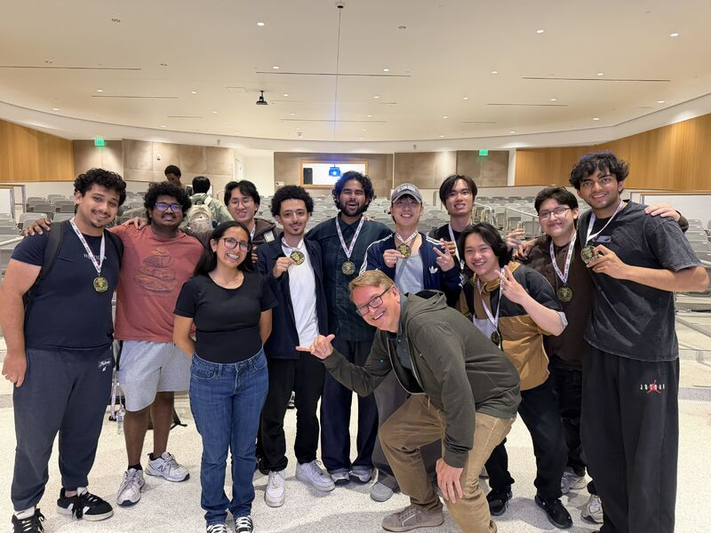

# Aditya Jadhav

CS student at UC San Diego building software across enterprise security, AI, and full-stack systems.

 

---

## Current Focus

- **Security automation at UC San Diego Enterprise IT:** Python pipelines, SQL workflows, and REST components that cut manual review effort by ~30% and added 20+ automated test cases
- **Hardware-facing desktop software at Lumulus Technologies:** Windows tooling for hardware programming workflows (PySide6); details kept public-safe under internship constraints
- **AI systems and production-minded backends:** multi-agent services, APIs, containerized deployments, and observability
- **B.S. in Computer Science @ UC San Diego** (expected June 2027)

---

## Selected Engineering Work

### [AI-Powered Travel Planning Platform](https://github.com/AdityaJadhav17/Travel-Agntcy)
**Problem:** Travel planning spans flights, hotels, and activities, but stitching those sources into a coherent plan is slow and fragmented.

**What I built:** A distributed multi-agent travel planner with a LangGraph supervisor, FastAPI services, and a React/TypeScript UI. Containerized the stack with Docker, used NATS for inter-service messaging, and added Grafana/ClickHouse observability.

**Stack:** Python · FastAPI · LangGraph · React · TypeScript · Docker · NATS · Grafana

**Result:** Cut inter-service latency by ~40% with containerized microservices and NATS messaging. Demo: [YouTube walkthrough](https://youtu.be/T0EkJ9J_IQU)

---

### [WatchTower](https://github.com/cse110-sp26-group09/Watchtower-Course-Project)
**Problem:** Web teams need lightweight production visibility for JS errors, latency, and user activity without a heavyweight vendor agent.

**What I engineered:** As Team Leader and Technical Lead (CI/CD and architecture) for UCSD CSE 110 Team 09, directed delivery and system design for a browser SDK, Node.js ingest API, Supabase/Postgres persistence, and a Clerk-authenticated real-time dashboard. Shipped CI with Jest and Playwright, plus a deployed Render backend.

**Stack:** JavaScript · Node.js · Supabase · Clerk · Jest · Playwright · Render

**Result:** Deployable observability platform with live backend and SDK test app. Live: [backend](https://watchtower-course-project-g8dv.onrender.com) · [test app](https://cse110-sp26-group09.github.io/Watchtower-test-app/) · [demo video](https://youtu.be/tCBGQJBaOEo)

---

### [Talk-to-Robot](https://github.com/YangLin14/Talk-to-Robot)
**Problem:** Natural-language robot commands fail when spatial grounding is mixed with control, making it hard to see where LLM understanding breaks.

**What I engineered:** Team project (CSE 190) with a decoupled LLM grounder and SAC+HER controller in MuJoCo FetchPush. Evaluated instruction tiers from literal coordinates to functional intent, isolating grounding failures from policy errors.

**Stack:** Python · Gemini · MuJoCo · Gymnasium · Stable-Baselines3 (SAC + HER)

**Result:** End-to-end success near-solved on literal/region tiers (T0 ~98%, T1 ~93%), with a clear cliff on relative and intent-heavy instructions (T2 ~77% LLM, T4 ~45-55%).

---

### [Synthetic-to-Real Object Detection](https://github.com/AdityaJadhav17/Synthetic-to-Real-Object-Detection)
**Problem:** Models trained only on synthetic images often fail on real photos; this Kaggle challenge measured that sim-to-real gap directly.

**What I built:** An end-to-end YOLOv8 detection pipeline with training, augmentation/domain randomization experiments, inference, and Kaggle submission tooling.

**Stack:** Python · PyTorch · YOLOv8 · Albumentations

**Result:** Public LB mAP **0.9175** / Private LB mAP **0.9074**. Competition: [Kaggle challenge](https://www.kaggle.com/competitions/synthetic-2-real-object-detection-challenge)

---

<strong>Additional work</strong> (workplace + projects without a public code repo)

 

**AI Chat Assistant (IBM Cloud)**  
Designed a Watson Assistant + Node.js/Express conversational system; handled 150+ test queries at 90%+ response accuracy. Demo: [YouTube](https://youtu.be/9sRefMjn5Es)

**Web Development Intern, NutrifitWorld**  
Shipped a responsive business platform with CRM, scheduling, and analytics workflows (Jun-Oct 2025).

---

## Technical Toolkit

| Area | Tools |
|------|--------|
| **Languages** | Python, C++, Java, C, JavaScript/TypeScript, SQL |
| **Backend & APIs** | FastAPI, Node.js, Express, REST, MySQL, MongoDB, Supabase |
| **Frontend** | React, Vite, HTML/CSS |
| **AI & Data** | PyTorch, TensorFlow, YOLOv8, LangGraph, MuJoCo, NumPy, Pandas |
| **Infra & Tools** | Docker, NATS, Grafana, AWS, IBM Cloud, Git, Linux, Windows, CI/CD |

---

## Engineering Interests

Problems I want to keep working on:

- AI-enabled products with clear system boundaries (agents, APIs, evaluation)
- Reliable backend systems: latency, observability, and maintainable interfaces
- Security automation that reduces manual toil without hiding risk
- Developer tooling that shortens feedback loops
- Hardware/software integration where desktop apps meet physical devices

---

## Let's Connect

Open to **software engineering internships**, **AI/ML engineering**, and **security-focused software** conversations.

Prefer a short technical discussion over a cold pitch. Reach me via:

- **Email:** [aditya.jadhav7910@gmail.com](mailto:aditya.jadhav7910@gmail.com)
- **LinkedIn:** [linkedin.com/in/aditya-jadhav-06484123a](https://www.linkedin.com/in/aditya-jadhav-06484123a/)
- **Portfolio / Resume:** [adityajadhav17.github.io](https://adityajadhav17.github.io/) · [PDF resume](https://adityajadhav17.github.io/Aditya_Jadhav_Resume.pdf)
