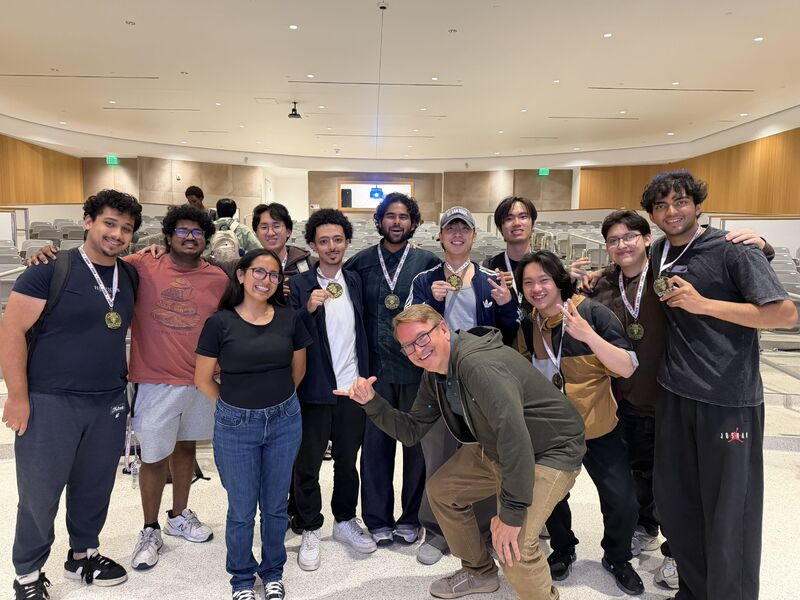

**I build full-stack apps, AI agent systems and security automation, then test them.**

 

<table>
<tr>
<td align="center" valign="top" width="25%"><h3>~30%</h3>less manual security review</td>
<td align="center" valign="top" width="25%"><h3>~40%</h3>lower latency across AI agents</td>
<td align="center" valign="top" width="25%"><h3>176</h3>automated tests on Stockroom</td>
<td align="center" valign="top" width="25%"><h3>0.9175</h3>Kaggle mAP, synthetic to real</td>
</tr>
</table>

 

## Now

**UC San Diego Enterprise IT** · I automated security reviews with Python, SQL and REST pipelines, cutting manual review work by about 30%. I also wrote 20+ automated tests for them.

**Lumulus Technologies** · As a software engineering intern, I build Windows tools in PySide6 for programming hardware.

**UC San Diego** · B.S. in Computer Science, graduating June 2027. Based in San Diego.

**Looking for** · Software engineering internships in full-stack, AI/ML or security.

 

## Projects

*Ranked by impact.*

### [WatchTower](https://github.com/cse110-sp26-group09/Watchtower-Course-Project) &nbsp;`Full-stack`
**Led the team that shipped a live monitoring platform.** As Technical Lead I owned CI/CD and architecture. Our browser SDK sends JavaScript errors, slow requests and user activity to a Node.js API, which stores them in Supabase and streams them to a Clerk-protected dashboard.

[Backend](https://watchtower-course-project-g8dv.onrender.com) · [Test app](https://cse110-sp26-group09.github.io/Watchtower-test-app/) · [Demo](https://youtu.be/tCBGQJBaOEo) &nbsp;|&nbsp; *JavaScript · Node.js · Supabase · Clerk · Jest · Playwright*

 

### [AI Travel Planner](https://github.com/AdityaJadhav17/Travel-Agntcy) &nbsp;`AI` `Full-stack`
**Cut inter-service latency by about 40%** by running the agents in Docker containers that talk over NATS. A LangGraph supervisor sends flight, hotel and activity searches to three FastAPI agents, and a React UI shows the combined plan.

[Demo](https://youtu.be/T0EkJ9J_IQU) &nbsp;|&nbsp; *Python · FastAPI · LangGraph · React · TypeScript · Docker · NATS*

 

### [Stockroom](https://github.com/AdityaJadhav17/Stockroom) &nbsp;`Full-stack` `Security`
**Wrote 165 integration tests and 11 browser tests for the purchase flow.** Members request stock and managers approve it. The app writes each stock change and its audit record in one transaction, so two requests can't sell the same item.

*C# · ASP.NET Core · EF Core · SQLite · Playwright*

 

### [Synthetic-to-Real Detection](https://github.com/AdityaJadhav17/Synthetic-to-Real-Object-Detection) &nbsp;`AI`
**Scored mAP 0.9175 (public) and 0.9074 (private) on Kaggle.** I trained YOLOv8 on synthetic images and ran domain-randomization experiments to make it work on real photos.

[Kaggle challenge](https://www.kaggle.com/competitions/synthetic-2-real-object-detection-challenge) &nbsp;|&nbsp; *Python · PyTorch · YOLOv8 · Albumentations*

 

### [Talk-to-Robot](https://github.com/YangLin14/Talk-to-Robot) &nbsp;`AI`
**Reached ~98% end-to-end success on literal robot instructions.** Our team split an LLM that reads the instruction from a SAC+HER controller in MuJoCo, so you can see whether a failed push came from the language model or the policy. Success drops to 50% on functional-intent instructions.

*Python · Gemini · MuJoCo · Stable-Baselines3*

 

### [Personal Tracker](https://github.com/AdityaJadhav17/Personal-Tracker) &nbsp;`Full-stack`
**Built a deadline and notes dashboard that keeps your data on your machine.** It runs in your browser with no account and no server.

*TypeScript · React · Vite*

<b>More work</b>

 

**AI Chat Assistant (IBM Cloud).** A Watson Assistant and Node.js/Express chatbot that answered 150+ test queries at 90%+ accuracy. [Demo](https://youtu.be/9sRefMjn5Es)

**NutrifitWorld (intern, Jun to Oct 2025).** I shipped a responsive business site with CRM, scheduling and analytics.

**WatchTower team.**  

 

## Toolkit

| Area | Tools |
|:--|:--|
| **Languages** |  + SQL |
| **Backend** |  |
| **Frontend** |  |
| **AI & Data** |  + LangGraph · YOLOv8 · NumPy · Pandas |
| **Infra** |  + NATS · Grafana |

 

Email me at [aditya.jadhav7910@gmail.com](mailto:aditya.jadhav7910@gmail.com) about internships or any project above.

